# TP1 — Prise en main du cluster Albator (SLURM) et de l'environnement Deep Learning

---

## 1. Connexion au cluster

Connexion en SSH au nœud de connexion `arcadia-slurm-controller` du cluster HPC Albator (Direction de l'Enseignement, Télécom SudParis).

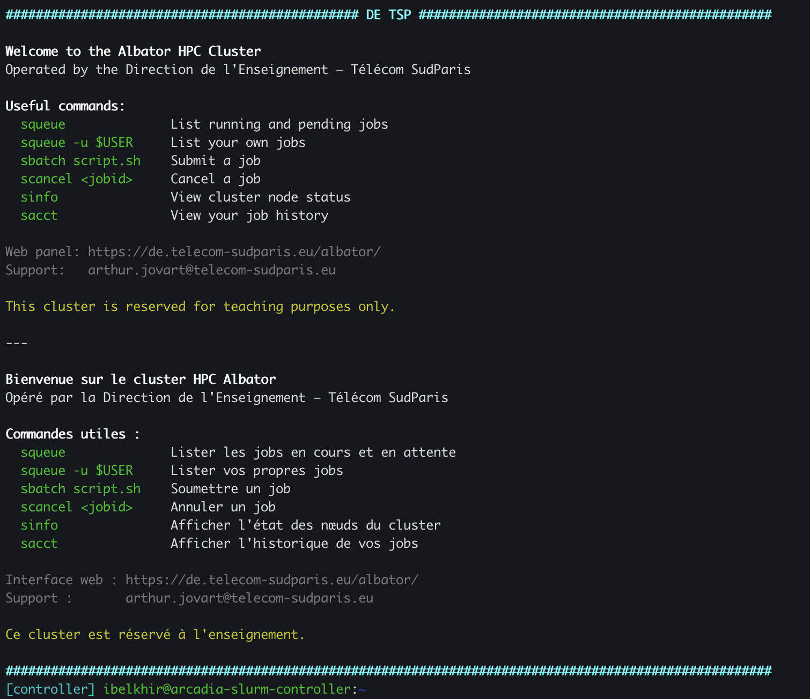

---

## 2. Accès à un GPU en mode interactif

### 2.1 `nvidia-smi` sur la machine de connexion

Sur le nœud de connexion, la commande échoue comme prévu : `nvidia-smi` n'est même pas installé, car cette machine ne dispose d'aucun GPU. Elle sert uniquement à se connecter et à soumettre des jobs.

J'ai ensuite demandé des ressources en mode interactif :

```bash
srun --partition=gpu --gres=gpu:1 --time=01:00:00 --cpus-per-task=1 --mem=8G --pty bash
```

SLURM m'a attribué le job **1540** sur le nœud `starfighter-slurm-node-03-1`.

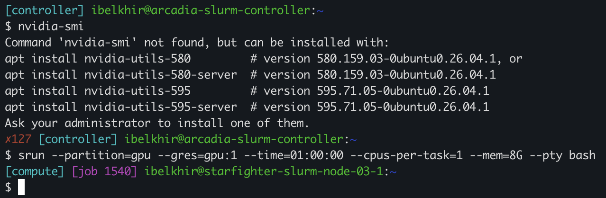

### 2.2 `nvidia-smi` sur le nœud de calcul

> **Quel est le modèle exact du GPU alloué ?**

Le GPU alloué est une **NVIDIA L4**, avec **23 034 MiB** de mémoire (environ 24 Go). Le driver est en version 595.84 et supporte CUDA jusqu'à la version 13.2. Au moment de la capture, le GPU était au repos (état P8, 0 % d'utilisation, aucun processus).

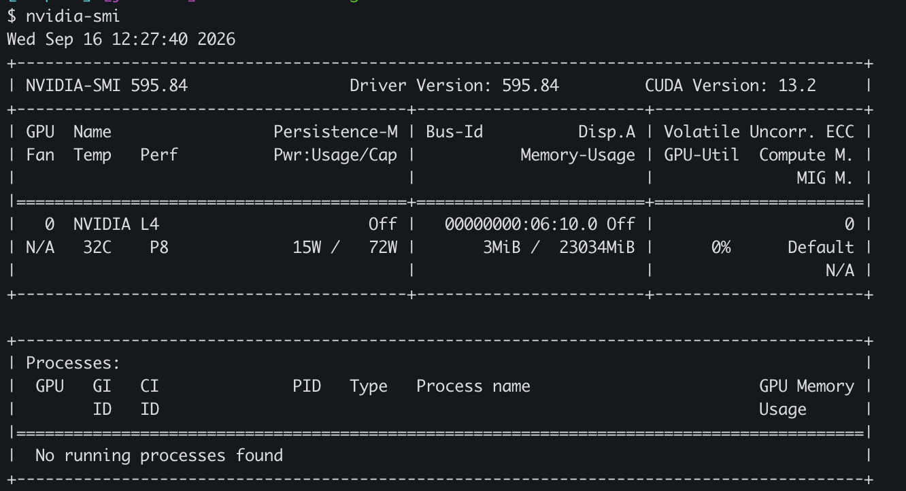

---

## 3. Suivi et annulation d'un job

Depuis un second terminal connecté au contrôleur, j'ai listé mes jobs :

```bash
squeue -u $USER
```

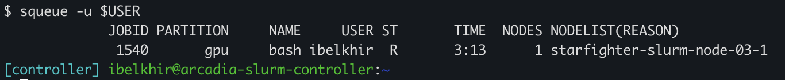

Le job interactif a le JobID **1540**, il est dans l'état `R` (*running*) sur `starfighter-slurm-node-03-1`.

> **Commande exacte utilisée pour annuler le job :**

```bash
scancel 1540
```

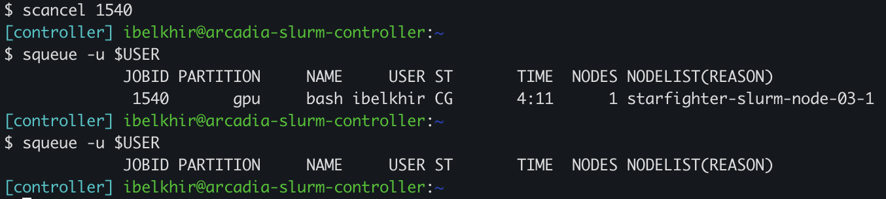

Juste après l'annulation, le job passe dans l'état `CG` (*completing*) le temps que SLURM libère les ressources, puis il disparaît de la file d'attente.

---

## 4. Partitions disponibles

```bash
sinfo -s
```

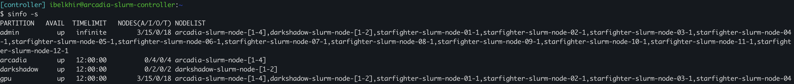

Quatre partitions sont visibles : `admin`, `arcadia`, `darkshadow` et `gpu`. La partition `gpu`, utilisée dans ce TP, regroupe 18 nœuds (3 alloués et 15 libres au moment de la commande) avec une durée maximale de **12 h** par job. La colonne `NODES(A/I/O/T)` se lit : alloués / inactifs (*idle*) / autres / total.

---

## 5. Soumission d'un job batch

Le script `hello.sh` (ajouté au dépôt Git dans le dossier `TP1`) :

```bash
#!/bin/bash
#SBATCH --partition=gpu
#SBATCH -t 01:00:00
#SBATCH --gres=gpu:1
#SBATCH --cpus-per-task=1
#SBATCH --mem=8G
#SBATCH -J hello-slurm
#SBATCH -o logs/%x-%j.out
#SBATCH -e logs/%x-%j.err

set -euo pipefail
mkdir -p logs

echo "Job $SLURM_JOB_ID on $SLURM_NODELIST"
nvidia-smi || echo "nvidia-smi indisponible"
echo "Bonjour depuis SLURM !"
```

Soumission :

```bash
sbatch hello.sh
```

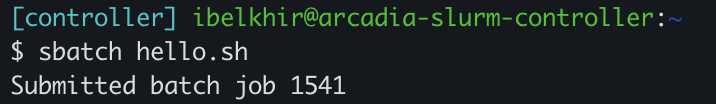

> **Quel est le nom exact du fichier de log généré ?**

Le fichier de sortie est **`logs/hello-slurm-1541.out`**. Son nom suit le motif `%x-%j.out`, où `%x` est le nom du job (`hello-slurm`, défini par `-J`) et `%j` son identifiant (`1541`). Les erreurs sont redirigées de la même façon vers `logs/hello-slurm-1541.err`.

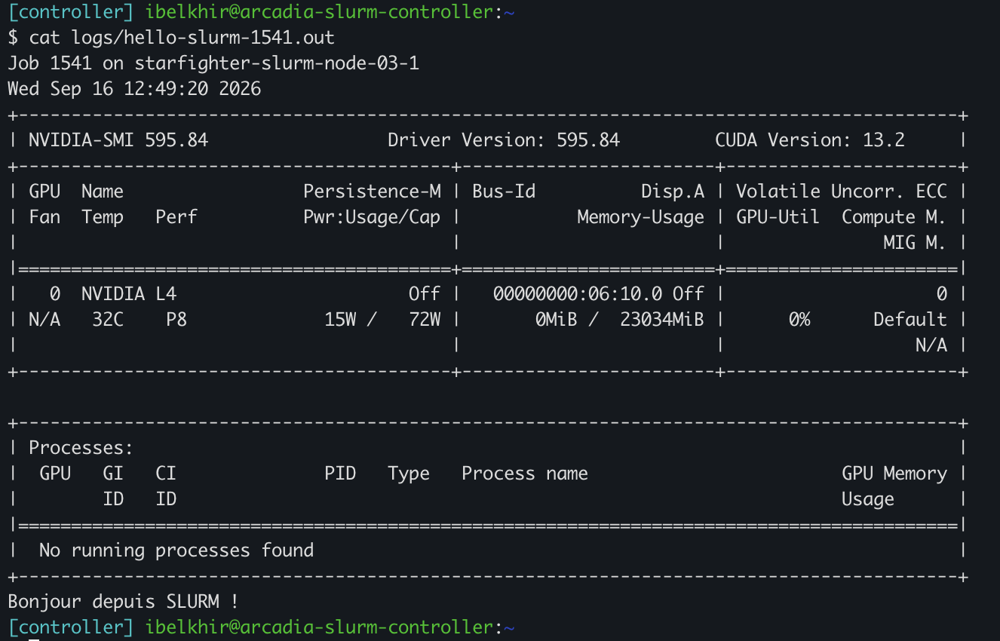

Le log confirme que le job s'est exécuté sur `starfighter-slurm-node-03-1`, qu'il a bien eu accès au GPU L4, et qu'il affiche le message final « Bonjour depuis SLURM ! ».

*Remarque :* SLURM ouvre les fichiers `-o` et `-e` **avant** d'exécuter le script. Le `mkdir -p logs` à l'intérieur du script arrive donc trop tard : si le dossier `logs/` n'existe pas au moment du `sbatch`, le job échoue sans produire de log. Il faut le créer au préalable.

---

## 6. Historique et consommation mémoire

```bash
sacct -j 1541 --format=JobID,State,Elapsed,MaxRSS,ReqMem,ReqCPUS
```

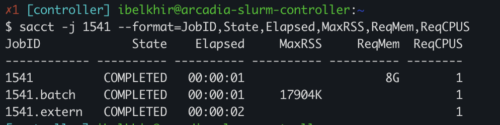

> **Différence entre `ReqMem` et `MaxRSS` :**

`ReqMem` est la mémoire **réservée** pour le job, c'est-à-dire ce que j'ai demandé à SLURM avec `#SBATCH --mem=8G` dans `hello.sh` : ici 8 Go. `MaxRSS` est la mémoire **réellement utilisée**, c'est-à-dire le pic de mémoire vive occupée par le processus pendant son exécution : ici 17 904 Ko, soit environ 17,5 Mo pour l'étape `1541.batch`. L'écart montre que j'ai réservé bien plus que nécessaire. Sur un cluster partagé, comparer ces deux valeurs permet d'ajuster ses demandes pour ne pas bloquer inutilement des ressources.

---

## 7. Environnement Python `deeplearning`

Après création de l'environnement (Python 3.10), je l'ai activé sur un nœud de calcul (job interactif 1544 sur `starfighter-slurm-node-02-1`) :

```bash
mamba activate deeplearning
```

> **Commandes pour vérifier la version de Python et le chemin du binaire :**

```bash
python --version
# Python 3.10.21

which python
# /mnt/hdd/homes/ibelkhir/miniforge3/envs/deeplearning/bin/python

echo $CONDA_DEFAULT_ENV
# deeplearning
```

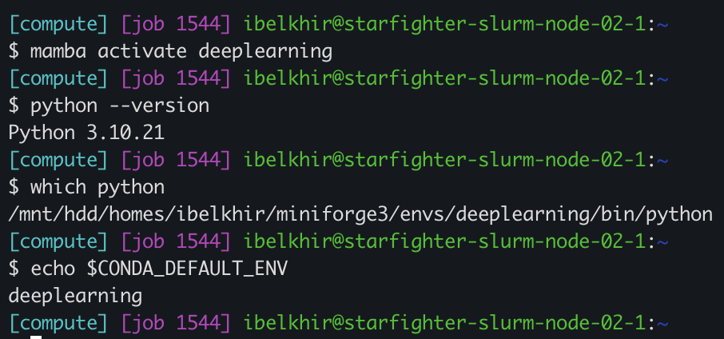

Le chemin du binaire pointe bien dans `envs/deeplearning`, ce qui confirme que c'est le Python de l'environnement qui est utilisé et non celui du système.

---

## 8. Vérification de l'accès au GPU depuis PyTorch

Script `check_gpu.py` :

```python
import torch

print("PyTorch version:", torch.__version__)
gpu_available = torch.cuda.is_available()
print("CUDA available:", gpu_available)

if gpu_available:
    print("Device count:", torch.cuda.device_count())
    print("Device 0 name:", torch.cuda.get_device_name(0))
else:
    print("Attention, aucun GPU détecté !")
```

> **Sortie du script :**

```
PyTorch version: 2.13.0
CUDA available: False
Attention, aucun GPU détecté !
```

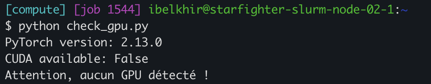

> **Deux raisons possibles au `CUDA available: False` :**

`torch.cuda.is_available()` ne renvoie `True` que si trois conditions sont réunies : PyTorch est compilé avec le support CUDA, un driver NVIDIA fonctionnel est présent, et au moins un GPU est visible pour le processus. Les causes possibles sont donc :

1. **Version CPU de PyTorch.** Le paquet installé peut être une build sans support CUDA (par exemple si le solveur a choisi la variante CPU). On le vérifie avec `python -c "import torch; print(torch.version.cuda)"` : `None` signifie que PyTorch n'a pas été compilé avec CUDA.
2. **Aucun GPU alloué au job.** Si la session interactive a été lancée sans `--gres=gpu:1` (ou sur un nœud sans GPU), SLURM ne rend aucun GPU visible au processus, même si la machine en possède. On le vérifie en lançant `nvidia-smi` ou `echo $CUDA_VISIBLE_DEVICES` dans le job.

Une troisième cause possible est une incompatibilité entre la version CUDA de la build PyTorch et le driver du nœud, mais elle est peu probable ici car le driver 595.84 supporte CUDA 13.2.

---

## 9. Fichier `environment.yml`

Le fichier suivant a été ajouté au dossier `TP1` du dépôt Git et commité, pour permettre de recréer l'environnement à l'identique (`mamba env create -f environment.yml`) :

```yaml
name: deeplearning
channels:
  - conda-forge
  - pytorch
dependencies:
  - pip
  - python=3.10
  - pytorch
  - pytorch-cuda=12.1
  - tensorboard
  - torchaudio
  - torchvision
```

---

## 10. Exercice 3 — Exercices théoriques

### 10.1 Architecture et paramètres


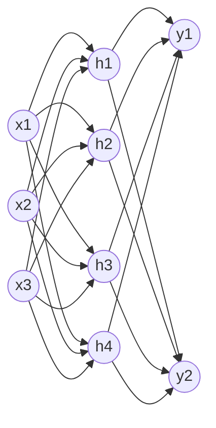

**Sans les biais :**
- Couche 1 (entrée → cachée) : 3 × 4 = 12 poids
- Couche 2 (cachée → sortie) : 4 × 2 = 8 poids
- **Total = 12 + 8 = 20 paramètres**

**Avec les biais :**
- Couche 1 : 3 × 4 + 4 = 16
- Couche 2 : 4 × 2 + 2 = 10
- **Total = 16 + 10 = 26 paramètres**

### 10.2 Équations et dimensions

```math
H = \text{ReLU}(X W_1^T + b_1)
```

```math
Y = H W_2^T + b_2
```

```
X  : (N, 3)
W1 : (4, 3)
b1 : (1, 4) -> diffusé en (N, 4)
H  : (N, 4)
W2 : (2, 4)
b2 : (1, 2) -> diffusé en (N, 2)
Y  : (N, 2)
```

Vérification : $(N,3)\cdot(3,4) = (N,4)$, puis $(N,4)\cdot(4,2) = (N,2)$.

### 10.3 Graphe de calcul et rétropropagation

$f(x,y,z) = \frac{x}{y} + z$, avec le nœud intermédiaire $q = \frac{x}{y}$, donc $f = q + z$.

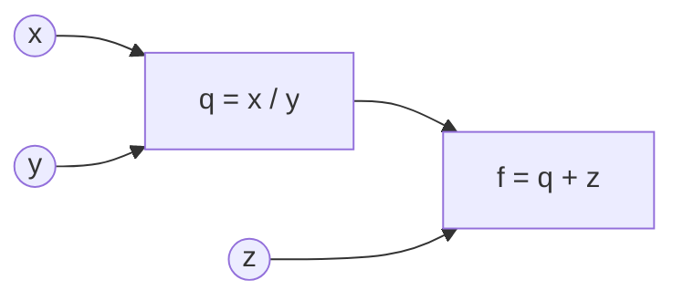

**Forward pass** ($x=2, y=4, z=0$) :

```math
q = \frac{2}{4} = 0.5 \qquad f = 0.5 + 0 = 0.5
```

**Backward pass :**

Gradients locaux du nœud d'addition :

```math
\frac{\partial f}{\partial q} = 1, \qquad \frac{\partial f}{\partial z} = 1
```

Gradients locaux du nœud de division :

```math
\frac{\partial q}{\partial x} = \frac{1}{y} = \frac{1}{4} = 0.25, \qquad \frac{\partial q}{\partial y} = -\frac{x}{y^2} = -\frac{2}{16} = -0.125
```

Règle de la chaîne :

```math
\frac{\partial f}{\partial x} = \frac{\partial f}{\partial q}\cdot\frac{\partial q}{\partial x} = 1 \times 0.25 = \mathbf{0.25}
```

```math
\frac{\partial f}{\partial y} = \frac{\partial f}{\partial q}\cdot\frac{\partial q}{\partial y} = 1 \times (-0.125) = \mathbf{-0.125}
```

```math
\frac{\partial f}{\partial z} = \mathbf{1}
```

### 10.4 Mise à jour (descente de gradient, η = 1)

```math
x' = x - \eta \frac{\partial f}{\partial x} = 2 - 0.25 = 1.75
```

```math
y' = y - \eta \frac{\partial f}{\partial y} = 4 + 0.125 = 4.125
```

```math
z' = z - \eta \frac{\partial f}{\partial z} = 0 - 1 = -1
```

```math
f' = \frac{1.75}{4.125} + (-1) = \frac{14}{33} - 1 = -\frac{19}{33} \approx -0.576
```

La fonction passe de $0.5$ à $\approx -0.576$ : elle a bien diminué.

### 10.5 Questions de réflexion

**Pourquoi utilisons-nous la règle de la chaîne (chain rule) pour calculer les gradients dans les réseaux de neurones profonds ?**

Un réseau profond est une composition de fonctions simples (couches linéaires, activations). La règle de la chaîne permet d'obtenir le gradient de la perte par rapport à chaque paramètre en multipliant des dérivées locales faciles à calculer. En réutilisant les résultats intermédiaires de la sortie vers l'entrée (rétropropagation), on calcule tous les gradients en une seule passe arrière, pour un coût comparable à celui du forward.

**Quelles sont les principales raisons d'utiliser des mini-batchs plutôt que d'optimiser sur un seul exemple à la fois ou sur l'ensemble total des données ?**

Optimiser avec l'ensemble des données est coûteux en ressources pour une seule mise à jour et utiliser un seul exemple ne sera pas représentatif du dataset (aléatoire on peut descendre dans la bonne direction comme l'opposé). Le mini-batch est un compromis qui permet de paralléliser les calculs, et le léger bruit restant aide à sortir de minima locaux.

### 10.6 Association

```
Tâche                   | Fonction finale (Sortie) | Fonction de perte (Loss)
------------------------|--------------------------|-----------------------------------------
Classification binaire  | 1. Sigmoïde              | A. Binary Cross-Entropy (BCE)
Classification multi    | 2. Softmax               | B. Cross-Entropy
Régression pure         | 3. Identité (aucune)     | C. MSE (Mean Squared Error)
```
---

## 11. Exercice 4 — Votre premier réseau de neurones

### Étape 1 : Préparation des données

**Expliquez brièvement à quoi servent les arguments batch_size et shuffle dans le DataLoader. Pourquoi shuffle doit-il avoir une valeur différente pour l'entraînement et pour le test ?**

batch_size fixe le nombre d'images à traité pour chaque mise à jour des poids (gradient calculé sur 32 images). shuffle permet de mélanger l'ordre des exemples à chaque epoch.

On mélange lors de l'entrainement pour que les batchs soient représentatifs du dataset, sans ça le modèle verrait toujours les exemples dans le même ordre et pourrait apprendre des biais liés à cet ordre. Au test, on ne mélange pas car les poids ne sont plus mis à jour, donc l'ordre n'a aucune influence sur la précision.

### Étape 2 : Implémentation du réseau

**Dans la méthode forward, pourquoi utilise-t-on torch.flatten(x, 1) avant de passer les données à la couche linéaire ?**
Les images arrivent en (N, 3, 32, 32), alors que nn.Linear attend (N, 3072). flatten(x, 1) aplatit tout sauf la dimension 0, donc chaque image devient un vecteur et le batch est conservé.

**Pourquoi est-il crucial de ne pas ajouter de fonction d'activation Softmax à la fin de notre réseau quand on s'apprête à utiliser nn.CrossEntropyLoss dans PyTorch ?**

On ne le fait car nn.CrossEntropyLoss applique déjà un Softmax.

### Étape 3 : Entraînement du modèle

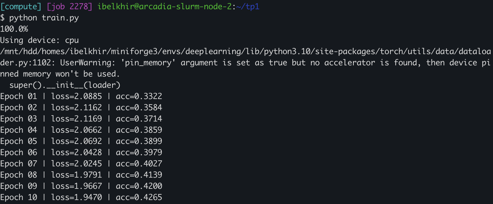

**Quelle est la différence fondamentale entre optimizer.zero_grad() et loss.backward() ?**

loss.backward() calcule les gradients de la perte par rapport à chaque paramètre lors de la backpropagation. optimizer.zero_grad() remet les gradients à zéro (utile lorsqu'on change de batch car PyTorch garde en mémoire les gradient précédent)

### Étape 4 : Évaluation sur l’ensemble de test

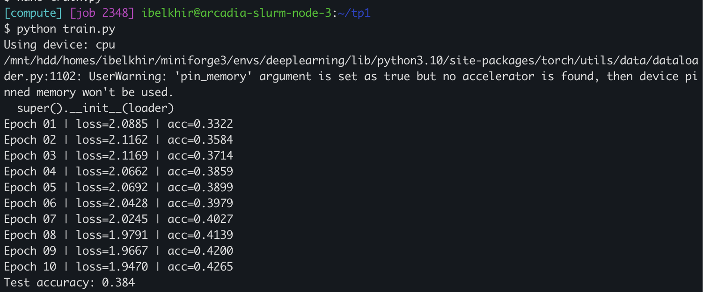

**Pourquoi utilise-t-on le bloc with torch.no_grad(): lors de l'évaluation ? Quel est l'avantage en termes de ressources matérielles ?**

On utilise ce bloc afin de désactiver le calcul des gradients, ce qui réduit la consommation de mémoire et de calcul. On le fait uniquement lors de l’évaluation, car les poids sont fixés, rendant leur mise à jour inutile.

**Si votre classificateur prédisait les classes de manière purement aléatoire, à quelle précision (accuracy) environ devriez-vous vous attendre sur le jeu de test CIFAR-10 ?**

On devrait attendre une précision de 10% sur ce jeu car c'est un datatest équilibré à 10 classes


